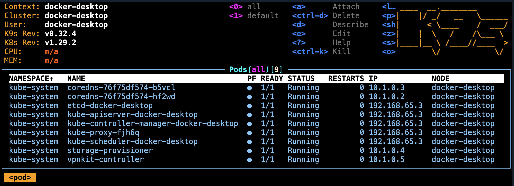

# Kube Sandbox
> 🚧 work in progress

This is a **DevContainer** project for Kubernetes development. All the necessary tools are installed in the container to develop, build, and deploy applications to a Kubernetes cluster.

## Check the status of the connection to the cluster

When Kubernetes is enabled in Docker Desktop, it automatically creates a Kubernetes context named docker-desktop. To list all available contexts, run:

```bash
kubectl config get-contexts
```
> You should see an entry for `docker-desktop`:

```bash
CURRENT   NAME                                     CLUSTER                AUTHINFO                         NAMESPACE
          /api-crc-testing:6443/developer          api-crc-testing:6443   developer/api-crc-testing:6443   
          crc-admin                                api-crc-testing:6443   kubeadmin/api-crc-testing:6443   default
          crc-developer                            api-crc-testing:6443   developer/api-crc-testing:6443   default
          default/api-crc-testing:6443/kubeadmin   api-crc-testing:6443   kubeadmin/api-crc-testing:6443   default
*         docker-desktop                           docker-desktop         docker-desktop 
```

To switch to the `docker-desktop` context, use:

```bash
kubectl config use-context docker-desktop
```

To ensure everything is set up correctly, you can check the cluster information:
```bash
kubectl cluster-info
```

> You should see output similar to:
```bash
Kubernetes control plane is running at https://127.0.0.1:59819
CoreDNS is running at https://127.0.0.1:59819/api/v1/namespaces/kube-system/services/kube-dns:dns/proxy
```


## Connect to the cluster with K9s

To connect to the cluster using K9s, run:

```bash
k9s --all-namespaces
```



## Install Traefik

```bash
helm repo add traefik https://traefik.github.io/charts
helm repo update
helm install traefik traefik/traefik

kubectl get services --all-namespaces
```

> You should see output similar to:
```bash
NAMESPACE     NAME         TYPE           CLUSTER-IP      EXTERNAL-IP   PORT(S)                      AGE
default       kubernetes   ClusterIP      10.96.0.1       <none>        443/TCP                      51m
default       traefik      LoadBalancer   10.96.207.167   172.19.0.5    80:31130/TCP,443:30264/TCP   10s
kube-system   kube-dns     ClusterIP      10.96.0.10      <none>        53/UDP,53/TCP,9153/TCP       51m
```

> And you can check that Traefik has been deployed successfully with K9s.

## Create a namespace

First create a `demo-dev` namespace:

```bash
kubectl create namespace demo-dev --dry-run=client -o yaml | kubectl apply -f -
```

## Deploy Redis

```bash
kubectl apply -f 01-deploy.redis.yaml -n demo-dev
kubectl apply -f 02-create.configmap.yaml -n demo-dev
kubectl apply -f 03-create.redis.client.pod.cli.yaml -n demo-dev
```

## Populate the Redis server with data

The script to populate the Redis server is created in the ConfigMap deployed in the previous step.
And this script is executed automatically when the Redis client pod starts.

## Build and publish the image

Update the `TAG` variable in the `docker-bake.hcl` file if needed:

```hcl
variable "REPO" {
  default = "philippecharriere494"
}

variable "TAG" {
  default = "2026-01-devcontainer"
}

group "default" {
  targets = ["paris-restaurants-image"]
}

target "paris-restaurants-image" {
  context = "."
  platforms = [
    "linux/amd64",
    "linux/arm64"
  ]
  tags = ["${REPO}/paris-restaurants:${TAG}"]
}
```

Then run the following command to build and push the image to Docker Hub:

```bash
docker buildx bake --push --file docker-bake.hcl
```

## Deploy the application

In the `04-deploy.app.yaml` file, update the image name with your Docker Hub username and the tag you used in the previous step:

```yaml
image: philippecharriere494/paris-restaurants:2026-01-devcontainer
```

```bash
kubectl apply -f 04-deploy.app.yaml -n demo-dev
```

## Get the ingress of the application

```bash
# demo-webapp is the service/ingress name
kubectl describe ingress demo-webapp -n demo-dev
```

Go to http://restaurants.0.0.0.0.nip.io to see the application running.


## Useful kubectl commands

**Delete the application**:
```bash
kubectl delete -f 04-deploy.app.yaml -n demo-dev
```

**Delete all the namespace**:
```bash
kubectl delete namespace demo-dev
```
